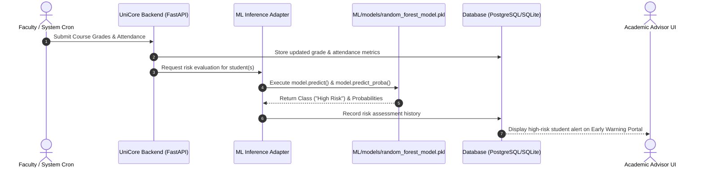

# UniCore Architecture Specification

This document details the architectural blueprint for the **UniCore** Academic Enterprise Resource Planning (ERP) and Student Risk Intelligence platform.

---

## 1. Architectural Principles

1. **Strict Decoupling of ML Artifacts**: The pre-trained machine learning assets located in `ML/` are treated as immutable core dependencies. The ERP backend interfaces with models in a read-only inference capacity.
2. **Modular Service Architecture**: The platform is partitioned into discrete layers (Frontend, Backend API, Database, ML Engine) ensuring high maintainability, independent testing, and clear responsibility boundaries.
3. **Event-Driven & Proactive Analytics**: Academic transactions (such as grade uploads or attendance deficits) automatically trigger predictive risk scoring through the ML engine.
4. **Role-Centric Experience**: Discrete interfaces and permission boundaries for Administrators, Faculty/Instructors, Academic Advisors, and Students.
5. **Modern Design Standards**: High-fidelity visual presentation, dynamic micro-interactions, responsive UI, and resilient RESTful API endpoints.

---

## 2. High-Level Architecture Diagram

```mermaid
flowchart TD
    subgraph ClientLayer ["Client Layer (Frontend)"]
        UI["React + Vite Single-Page Application"]
        AdminView["Admin Console"]
        FacultyView["Faculty & Grading Hub"]
        StudentView["Student Dashboard"]
        AdvisorView["Early Warning & Risk Center"]
        UI --> AdminView
        UI --> FacultyView
        UI --> StudentView
        UI --> AdvisorView
    end

    subgraph APILayer ["Application & Backend Layer"]
        API["FastAPI REST API Gateway"]
        AuthService["Auth & RBAC (JWT)"]
        StudentService["Student Management"]
        AcademicService["Attendance & Grades"]
        MLService["ML Inference Adapter (Read-Only)"]
        
        API --> AuthService
        API --> StudentService
        API --> AcademicService
        API --> MLService
    end

    subgraph DataLayer ["Data & Persistence Layer"]
        DB[(PostgreSQL / SQLite Database)]
        StudentService --> DB
        AcademicService --> DB
        AuthService --> DB
    end

    subgraph MLLayer ["Machine Learning Engine (ML/) [FROZEN]"]
        Model1["random_forest_model.pkl (Full Cycle)"]
        Model2["early_random_forest_model.pkl (Midterm Alert)"]
        MLService -.->|joblib.load (Read-Only)| Model1
        MLService -.->|joblib.load (Read-Only)| Model2
    end

    ClientLayer <-->|HTTPS / JSON REST API| APILayer
```

---

## 3. Subsystem Breakdown

### 3.1. Frontend (`frontend/`)
- **Technology**: React with Vite, Vanilla CSS design tokens (custom styling, vibrant typography, glassmorphism, responsive breakpoints).
- **Key Modules**:
  - **Auth & Session**: Secure token storage, role-aware route guards.
  - **Academic Dashboard**: Visual summaries of attendance averages, GPA projections, and course schedules.
  - **Risk Analytics Console**: Multi-tier risk categorization (`High Risk`, `Medium Risk`, `Low Risk`) with probability distribution breakdowns.
  - **Faculty Grading & Attendance Grid**: Fast data entry surfaces for quizzes, assignments, midterm, and attendance tracking.

### 3.2. Backend API (`backend/`)
- **Technology**: Java 17+, Spring Boot 3.4.3, Spring Data JPA, Spring Security 6, Maven.
- **Architecture**: Clean layered design partitioned into:
  - `controller/`: REST controllers handling HTTP requests and input validation (`@Valid`).
  - `service/`: Domain business logic, isolation enforcement, and data transformations.
  - `repository/`: Spring Data JPA repositories interfacing with the MySQL database.
  - `entity/`: JPA entities (`User`, `StudentProfile`, `FacultyProfile`, `ApprovedStudent`, `ApprovedFaculty`).
  - `security/`: Stateless JWT generation, validation, filter chain, and user details service.
  - `config/`: Security filters, password encoders (BCrypt), and CORS policies.
  - `exception/`: Centralized `@RestControllerAdvice` error handler returning uniform JSON error responses.
  - `dto/`: Request/Response transfer objects ensuring internal hashes and passwords are never exposed.

### 3.3. Database Layer (`database/`)
- **Technology**: PostgreSQL (production) / SQLite (local development), managed with Alembic migrations.
- **Key Entities**:
  - `users`: ID, email, hashed_password, role (`ADMIN`, `FACULTY`, `ADVISOR`, `STUDENT`).
  - `students`: Roll number, user_id, department, batch year, semester.
  - `courses`: Course code, name, credits, instructor_id.
  - `attendance`: Student ID, course ID, date, status, total percentage cached.
  - `grades`: Student ID, course ID, assessment type (`MIDTERM`, `FINAL`, `ASSIGNMENT`, `QUIZ`, `PROJECT`), score.
  - `risk_assessments`: Computed risk score, predicted risk level, probability breakdown, assessment timestamp, early vs. full model indicator.

### 3.4. Machine Learning Engine (`ML/`) [COMPLETED]
- **Status**: Finished & Frozen.
- **Contents**:
  - `models/random_forest_model.pkl`: Classifier evaluating 7 features:
    1. `Attendance (%)` (0–100)
    2. `Midterm_Score` (0–100)
    3. `Final_Score` (0–100)
    4. `Assignments_Avg` (0–100)
    5. `Quizzes_Avg` (0–100)
    6. `Participation_Score` (0–10)
    7. `Projects_Score` (0–100)
  - `models/early_random_forest_model.pkl`: Early warning classifier evaluating 6 features (excludes `Final_Score`) for mid-semester proactive intervention.
  - `data/`: Training data, test sets, and baseline risk scores.
- **Governance**: No modifications, re-training, or replacements allowed.

---

## 4. ML Inference Integration Flow



---

## 5. Security & Access Control (RBAC)

| Role | Access Permissions |
| :--- | :--- |
| **Admin** | System configuration, user provisioning, audit logging, system health. |
| **Faculty** | Course management, attendance marking, grade submission, student notes. |
| **Advisor** | Risk dashboards, intervention logging, student progress monitoring. |
| **Student** | Personal grade view, attendance check, course schedules, risk guidance. |

---

## 6. Directory Layout Blueprints

See [README.md](README.md) and [UNICORE_PROJECT_STATE.md](UNICORE_PROJECT_STATE.md) for full directory structural mappings.
